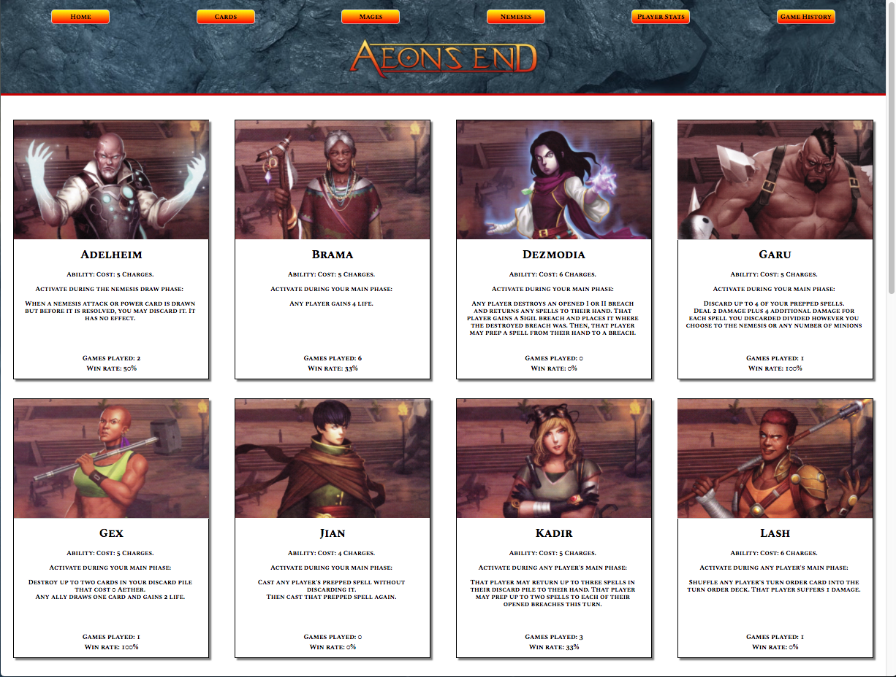

# Aeons End App
Aeons End is a two to four player deck building cooperative survival game. This is a collaborative project that makes it easier for a team of players to set up a game session, save game data, and review stats for cards and characters.

## Installation
#### Starting the server:
1. In the terminal, run ""./bin/webpack".
2. In another terminal, run "bundle exec rails server".

#### Frontend Dependencies:
- React: react-rails gem.
- [Lodash](https://www.npmjs.com/package/lodash): a JavaScript library.
- [axios](https://www.npmjs.com/package/axios): an HTTP client for the browser and node.js.

#### Backend Dependencies:
- Ruby on Rails
- Database: Postgres

## Usage
#### Randomizer
A 2-player randomizer that selects mages, a nemesis, and market cards for a game session. User can record outcome of the game.

### Cards
Displays all the cards in the expansions, including gems, relics, spells, and each mage's unique cards. Each card has its information and its win rate from saved game data.

### Mages
Displays all the mages in the expansions, including information about their unique abilities, their starting cards, and their win rate from saved game data.

### Nemeses
Displays all the nemeses in the expansions, including information about their difficulty level (rated by the creators of the game) and their loss rate from saved game data.

### Player Stats
Displays all the players on your team, including their win rate from saved game data.

### Game History
Displays all the games played by your team, including the date and time, the difficulty rating of the game, if the game was a win or loss, players, mages played, nemesis, market cards, and notes. Also includes a delete button to delete a specific game.

## Development
#### Design
- [Wireframes](./docs/wireframes.md)

#### Documentation guidelines:
- Ruby: [YARD](http://www.rubydoc.info/gems/yard/file/docs/GettingStarted.md) and [RDoc](https://ruby.github.io/rdoc/)
- Javascript: [JSDoc](http://usejsdoc.org/)

## Collaborators
- [James Lee](https://github.com/jamesleejl)

## License
Refer to "LICENSE" file for more information.
