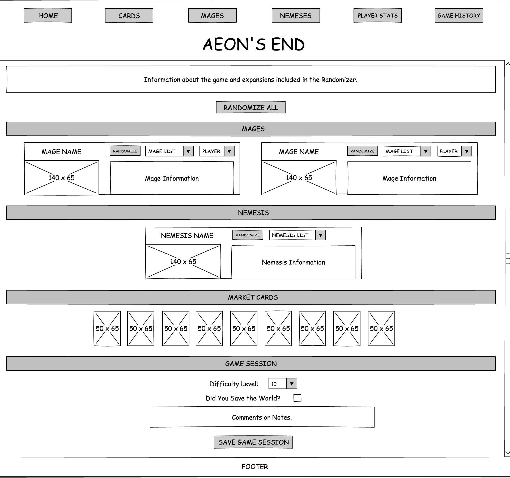
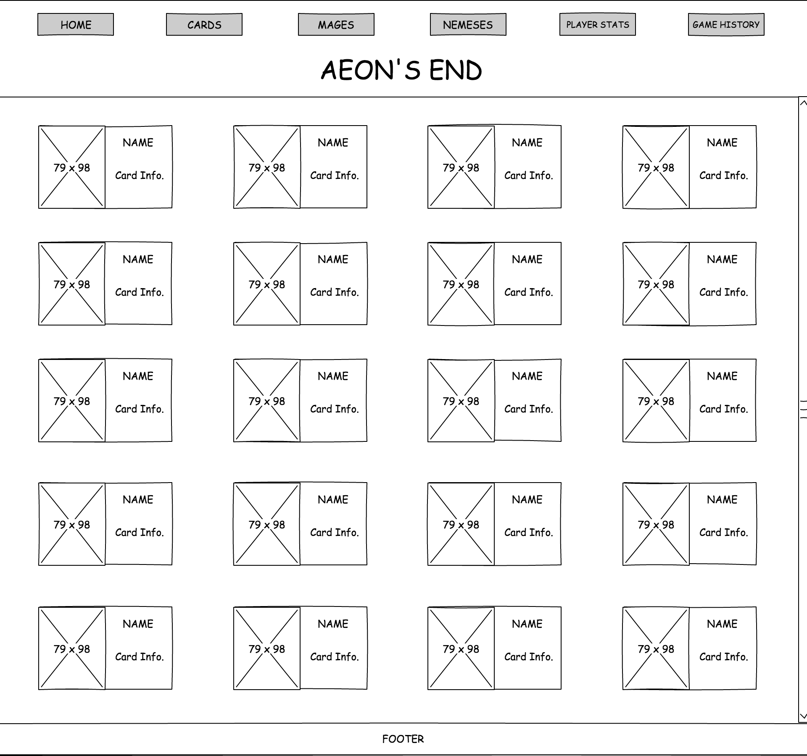
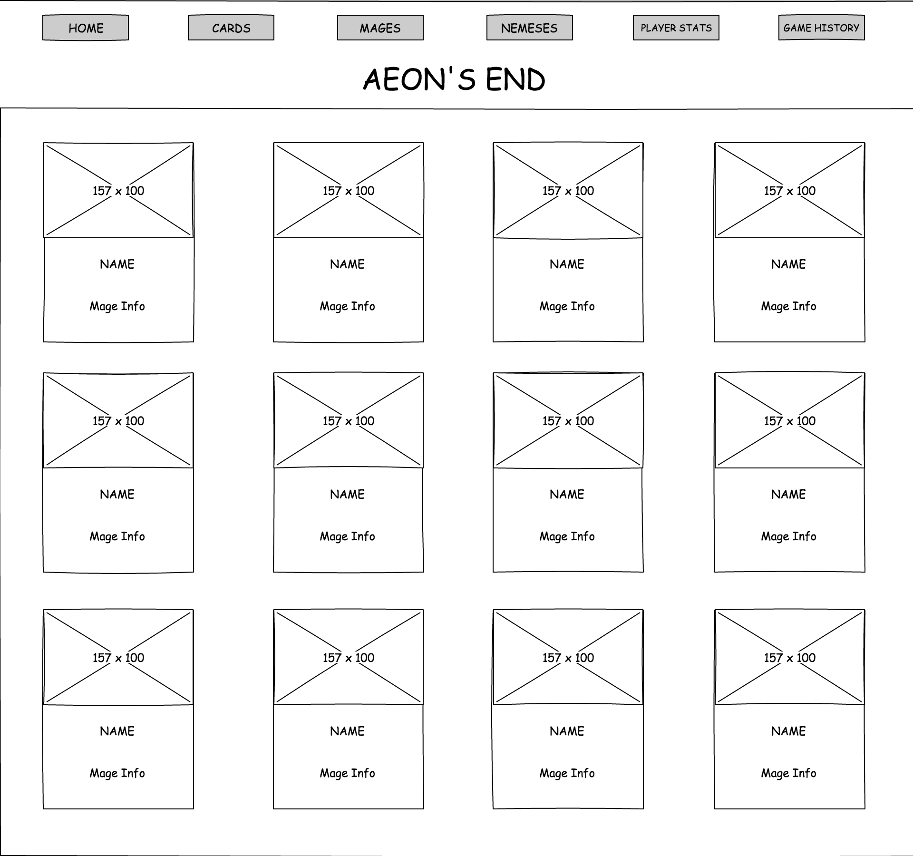
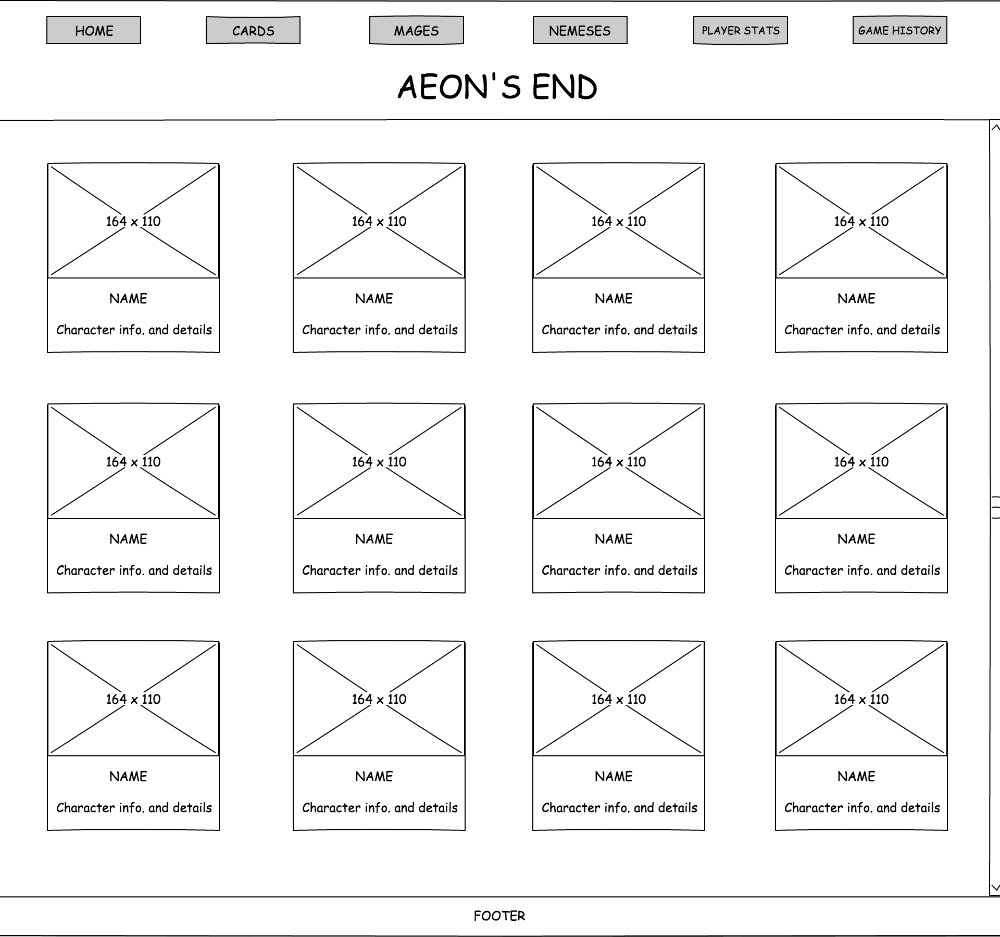
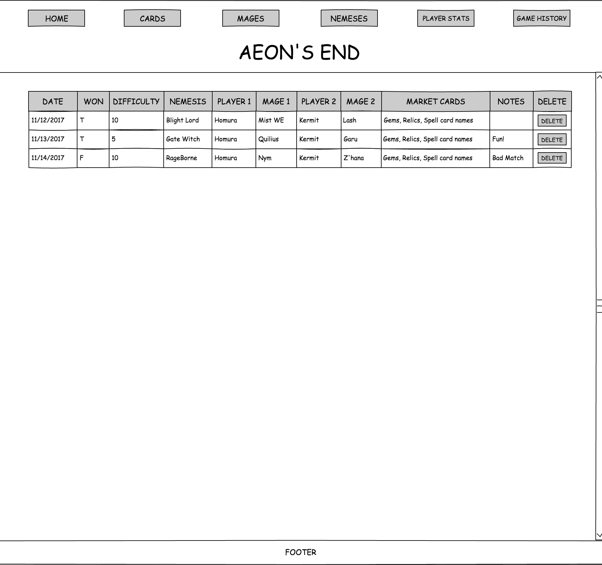

# Wireframes

## Home
A brief summary about the game and the expansions included in the randomizer.

The 2-player randomizer will have a "randomize all" button at the top, and each section will be under their respective title tags. Each section will have a "randomize" section only button. The mages and nemeses section will also have the option to select a specific character from a drop down list.

A section for entering in the game result and a save game button will be after the randomizer.

## Cards
Each game card will be displayed as a card with its image on the left and the details on the right.

## Mages
Each mage will be displayed as a card with their image at the top and their details below the image.

## Nemeses and Player Stats
Each nemesis and player will be displayed as a card with their image or avatar at the top and their details below the image.

## Game History
Displays all saved game data in a table. Each game is displayed as a row.

